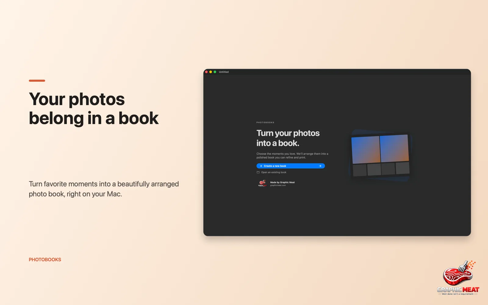
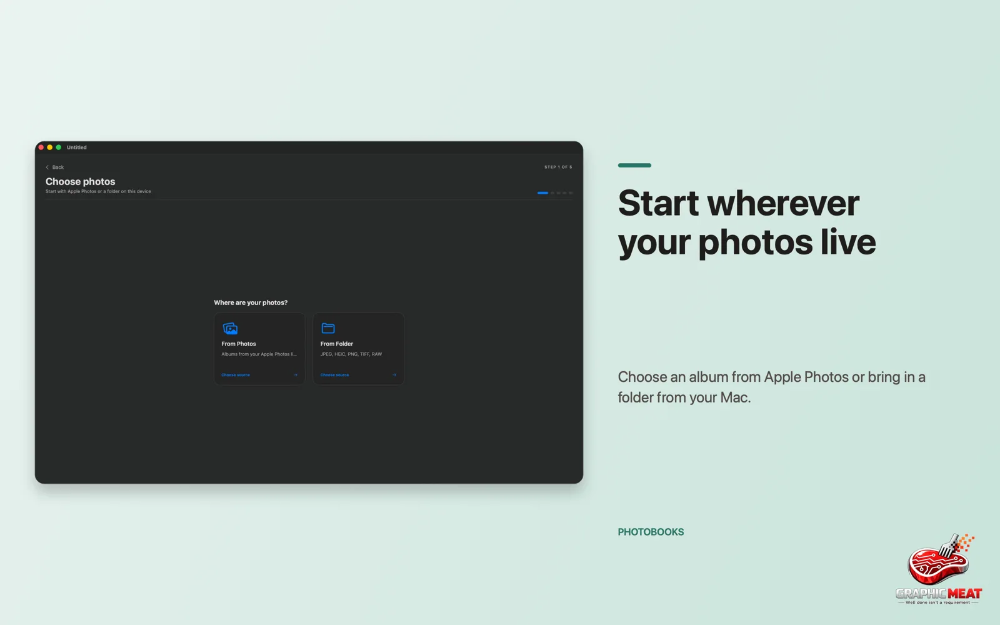
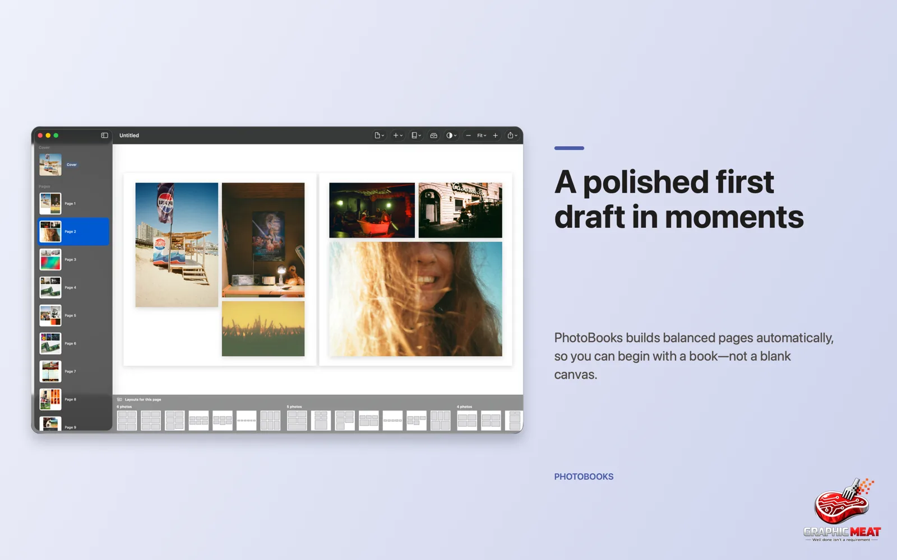
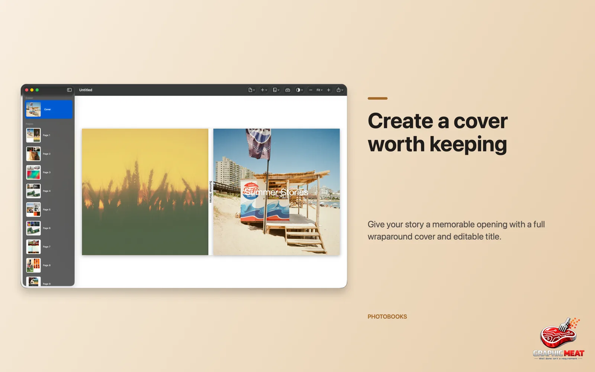
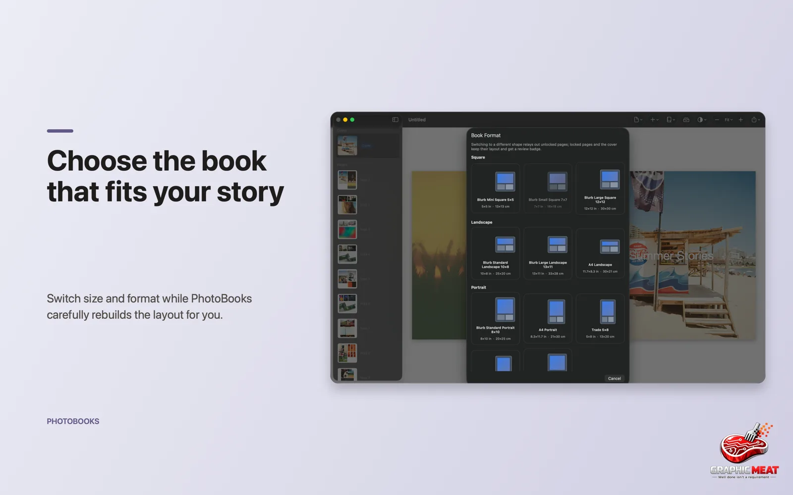
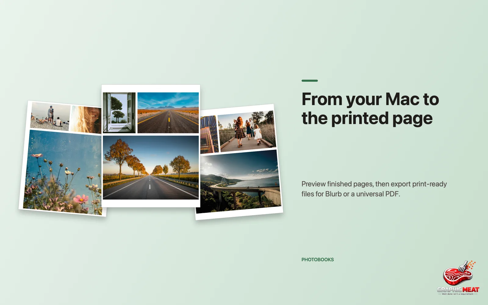

# PhotoBooks

Turn albums from Apple Photos or folders of images into beautifully arranged,
print-ready photo books. Native SwiftUI app for macOS 15+ and iOS 18+.


The smart layout engine builds a polished first draft in moments, so you begin
with a book — not a blank canvas.

## Features

**Make a book, not a grid**
- Import from Apple Photos (native photo picker) or any folder of images
- Auto-curation picks a balanced selection — aesthetics, duplicate removal, time diversity — which you review before the book is built
- Hybrid layout engine (templates + generative partitioning, unified by a scorer) creates varied, harmonious pages automatically
- Zero-crop justified, masonry, and grid layout styles; two-page spreads with gutter-safe cropping
- Photo importance (faces, saliency, sharpness via Vision) gives standout shots more room
- Change book size or format any time and the layout rebuilds intelligently

**Make it yours**
- Emphasize, replace, add, or remove photos; per-photo weight reflows the whole book
- Drag to move, drag corners to resize, with snapping to margins and neighbors
- Precise crop with zoom and positioning
- Freeform text boxes anywhere on the page
- Framed, tiled, or borderless edge styles; per-page background colors
- Wraparound cover with editable spine title and auto-picked back-cover photo
- Photo tray keeps unused photos close; reorder pages while preserving the cover
- Trim / bleed / safe-area page guides

**Ready for print or sharing**
- Blurb-ready cover and interior PDFs
- Print-ready PDF with bleed for any print service
- Lightweight digital PDF for sharing and on-device viewing
- WYSIWYG: screen and PDF renderers share the same layout math

**Native throughout**
- Document-based app — books are regular files you can store and sync anywhere
- Localized in 9 languages (English, German, French, Spanish, Italian, Japanese, Korean, Simplified Chinese, Brazilian Portuguese)
- macOS ships in two channels: App Store build and notarized DMG with Sparkle auto-updates (see [Releases](https://github.com/GraphicMeat/PhotoBooks/releases))

## Screenshots

| | |
|---|---|
|  |  |
|  |  |
|  |  |
|  |  |
|  |  |

## Repository layout

- `Packages/PhotoBookCore` — document model, layout engine, scoring, pagination (pure Swift, no UI imports)
- `Packages/PhotoBookImport` — photo source providers (PhotoKit, filesystem)
- `Packages/PhotoBookRender` — screen + PDF renderers (shared layout math; WYSIWYG screen/print)
- `Packages/EditCore`, `ModelLayer`, `AppSupport` — editing model, document plumbing, shared app support
- `Packages/SetupFeature`, `EditorFeature`, `ExportFeature`, `DocumentUI` — feature UI packages
- `App/` — thin multiplatform SwiftUI document-app shell

## Development

Run the package test suites:

```sh
swift test --package-path Packages/PhotoBookCore
swift test --package-path Packages/PhotoBookImport
swift test --package-path Packages/PhotoBookRender
```

Generate the Xcode project and build/test the app (the `.xcodeproj` is generated, not committed):

```sh
xcodegen generate
xcodebuild -project PhotoBooks.xcodeproj -scheme PhotoBooks -destination 'platform=macOS' test
```
