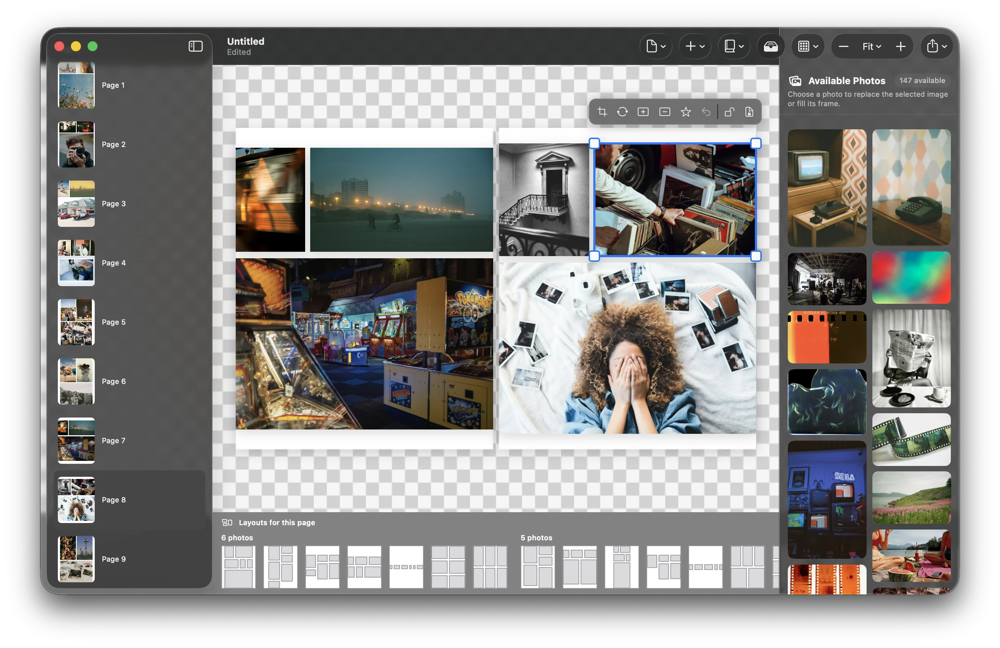
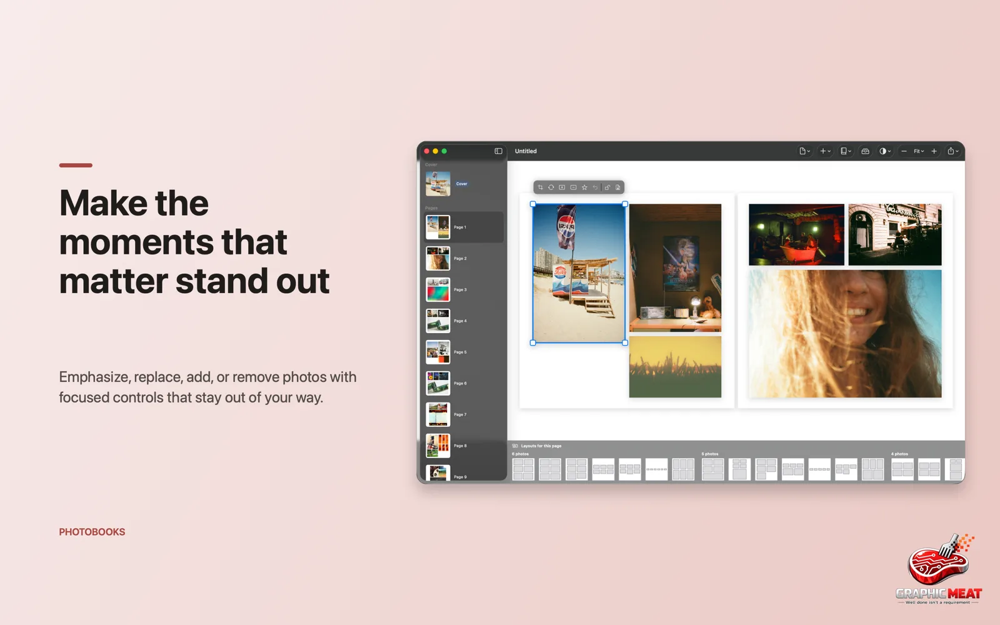
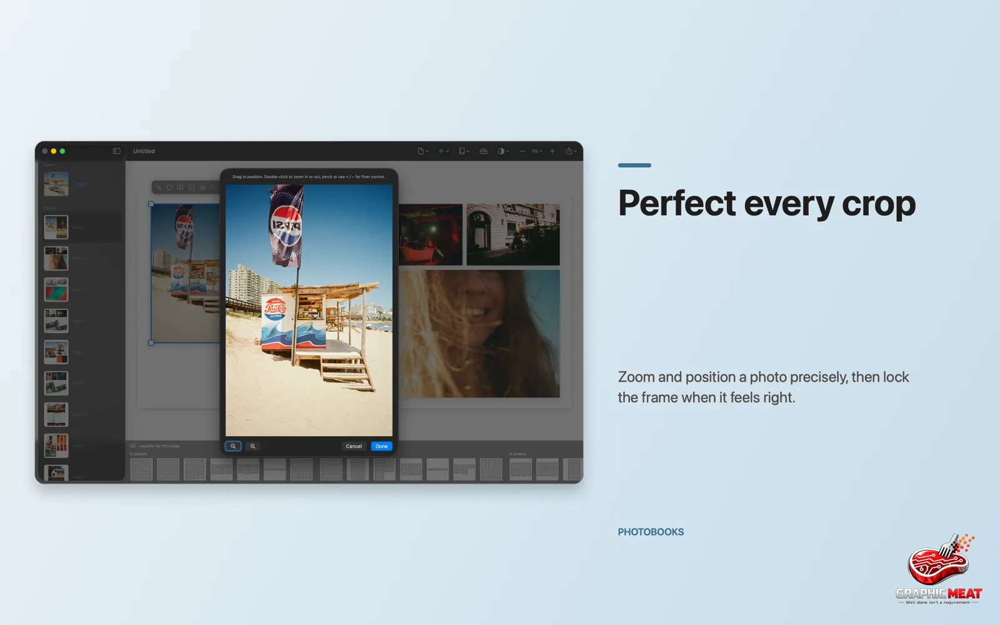
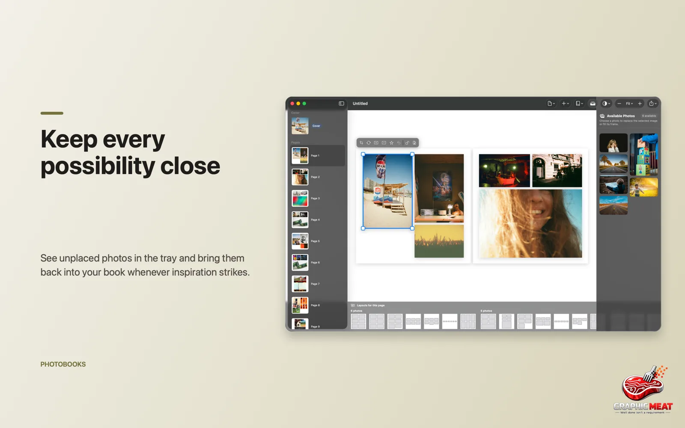

<p align="center">
  
</p>

<h1 align="center">PhotoBooks</h1>

<p align="center">
  <b>Your photos deserve more than a folder.</b><br>
  Turn albums into beautifully arranged, print-ready photo books — native for macOS and iOS.
</p>

<p align="center">
  macOS 15+ · iOS 18+ · No account · Local files · SwiftUI<br>
  <a href="https://graphicmeat.com/photobooks">graphicmeat.com/photobooks</a>
</p>

---



PhotoBooks turns albums from Apple Photos or folders on your Mac into finished photo books. A smart layout engine builds a polished first draft in moments, so you begin with a book — not a blank canvas. Your books are ordinary document files that live wherever you keep them; nothing leaves your machine.

## Features

### A book, not a grid


- **Balanced pages, automatically** — a hybrid layout engine (templates + generative partitioning, unified by a scorer) creates varied, harmonious spreads from your photos.
- **Zero-crop layouts** — justified, masonry, and grid styles that respect every photo's framing; two-page spreads with gutter-safe cropping.
- **Photos that matter get more room** — faces, saliency, and sharpness (via Vision, on device) give standout shots larger slots.
- **Rebuild any time** — change the book size or format and the layout reflows intelligently.

### Start from a curated selection


Point PhotoBooks at an Apple Photos album or a folder and it proposes a balanced selection — scored for aesthetics, with duplicates removed and moments spread across time. Review and adjust before the book is built.

### Make it yours



- **Emphasize, replace, add, or remove** — per-photo weight reflows the whole book.
- **Direct manipulation** — drag to move, drag corners to resize, with snapping to margins and neighbors.
- **Freeform text** — add text boxes anywhere on the page.
- **Three edge styles** — framed, tiled, or borderless; per-page background colors; trim / bleed / safe-area guides.

### Perfect every crop



Precise zoom and positioning inside each slot, with the gutter and trim always visible — what you frame is what prints.

### Nothing gets lost



Unused photos wait in the photo tray, ready to swap in. Reorder pages freely — the cover stays put.

### A real cover


Wraparound cover with an editable title and spine text. The back cover picks its own best photo — override it if you disagree.

### Any format


Square, portrait, and landscape presets with sizes in centimeters and inches. Switch late in the process — the book rebuilds around the new dimensions.

### Ready for print or sharing


- **Blurb-ready** cover and interior PDFs for PDF-to-Book printing.
- **Print-ready PDF with bleed** for any other print service.
- **Digital PDF** — lightweight, for sharing and on-device viewing.
- **WYSIWYG** — screen and PDF renderers share the same layout math, so the print matches the preview.

### Localized

English, Deutsch, Français, Español, Italiano, 日本語, 한국어, 简体中文, Português (Brasil).

## Requirements

- macOS 15 Sequoia or later, or iOS 18 or later
- Distribution: notarized direct download with Sparkle auto-updates — grab the DMG from [graphicmeat.com/photobooks](https://graphicmeat.com/photobooks) or [Releases](https://github.com/GraphicMeat/PhotoBooks/releases)

## Building

```sh
brew install xcodegen
xcodegen generate
open PhotoBooks.xcodeproj
```

The app is a thin SwiftUI shell over local Swift packages:

- [PhotoBookCore](Packages/PhotoBookCore/) — document model, layout engine, scoring, pagination (pure Swift, no UI imports)
- [PhotoBookImport](Packages/PhotoBookImport/) — photo source providers (PhotoKit, filesystem)
- [PhotoBookRender](Packages/PhotoBookRender/) — screen + PDF renderers (shared layout math)
- [EditCore](Packages/EditCore/), [ModelLayer](Packages/ModelLayer/), [AppSupport](Packages/AppSupport/) — editing model, document plumbing, shared support
- [SetupFeature](Packages/SetupFeature/), [EditorFeature](Packages/EditorFeature/), [ExportFeature](Packages/ExportFeature/), [DocumentUI](Packages/DocumentUI/) — feature UI packages

Run the core test suites:

```sh
swift test --package-path Packages/PhotoBookCore
swift test --package-path Packages/PhotoBookImport
swift test --package-path Packages/PhotoBookRender
```

---

<p align="center">Made by <a href="https://graphicmeat.com">Graphic Meat</a></p>
