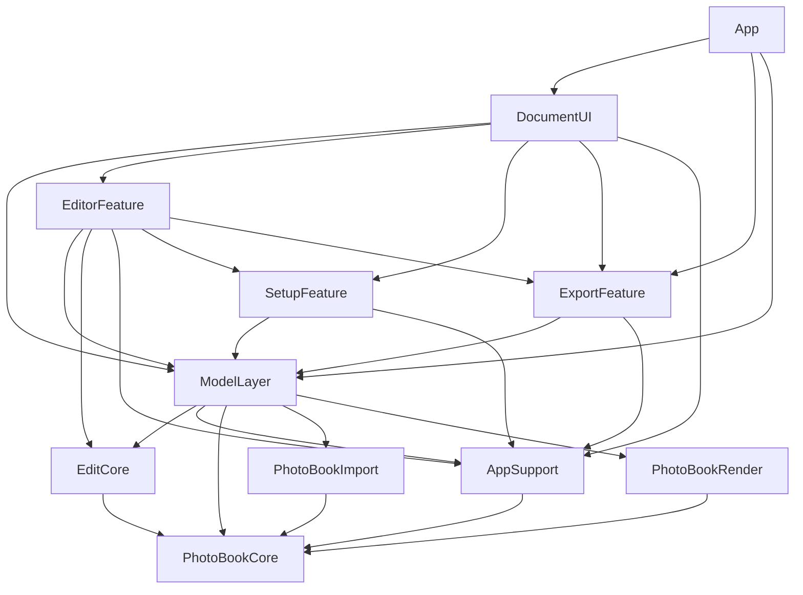

# Codebase Map: PhotoBooks

analyzed-at: 8750815   date: 2026-07-04   scope: Packages/ (10 SPM modules) + App/ shell

A SwiftUI multiplatform (iOS 18 / macOS 15) app that auto-lays-out photo books
from an imported photo set and exports print-ready PDF. Single app target with
`#if os(...)` branches; all logic lives in 10 path-referenced local SPM packages,
with `App/` a thin `@main` shell.

## Stack

- **Language:** Swift 6.0, `SWIFT_STRICT_CONCURRENCY: complete` (strict actor isolation on).
- **UI:** SwiftUI, one multiplatform target (`supportedDestinations: [iOS, macOS]`).
- **Deployment:** iOS 18.0 / macOS 15.0. Bundle `com.graphicMeat.PhotoBooks`.
- **Project generation:** XcodeGen — `.xcodeproj` is GENERATED and git-ignored.
  Run `xcodegen generate` after editing `project.yml` or adding app-target test
  files (otherwise new app tests silently don't run).
- **Build/test:** `xcodegen generate` then `xcodebuild` (app); `swift test` per package.
- **Signing:** Debug = ad-hoc (`-`), sandbox + entitlements still apply.
  Release = Xcode-managed automatic, Apple Distribution, hardened runtime (macOS),
  team YXDJG24NWG. App Store distribution channel.
- **Key frameworks:** PhotoKit (import), PDFKit / CoreGraphics (render/export),
  Vision (photo importance — faces + saliency + sharpness).
- **Size:** ~11.4k LOC source, ~14.6k LOC tests across 193 Swift source files.
  Test-heavy: PhotoBookCore 34 src / 40 test, ModelLayer 8 / 18, PhotoBookRender 15 / 18.
- **EOL flags:** none. Swift 6 + iOS18/macOS15 are current.

## Architecture

Clean layered SPM graph, no cycles. Four tiers, dependencies point downward only:

- **Core / domain (leaf):**
  - `PhotoBookCore` — the engine. Book/Spread/Page/Slot model, `BookEngine`
    (make/reshuffle/repaginate/alternatives), layout providers
    (Grid/Masonry/Justified/Generative), `Paginator`, templates (JSON resources).
    Highest blast radius — everything depends on it.
  - `AppSupport` — shared app utilities (color hex, settings, helpers).
- **Mid / services:**
  - `EditCore` → PhotoBookCore. Edit mutations over the model.
  - `PhotoBookImport` → PhotoBookCore. PhotoKit + filesystem photo providers,
    security-scoped bookmarks.
  - `PhotoBookRender` → PhotoBookCore. SwiftUI page rendering, manipulation
    handles, PDF export.
- **Model layer:**
  - `ModelLayer` → EditCore, AppSupport, PhotoBookCore, PhotoBookImport,
    PhotoBookRender. `BookEditorModel` = the app's central observable state +
    single mutation funnel (undo/redo), `BookDocument`, `ExportModel`.
- **Features (UI):**
  - `SetupFeature` → ModelLayer, AppSupport. New-book setup, preset picker.
  - `ExportFeature` → ModelLayer, AppSupport. Export flow UI.
  - `EditorFeature` → ModelLayer, EditCore, AppSupport, SetupFeature, ExportFeature.
    `BookBrowserView` = main editor screen, popovers, manipulation wiring.
  - `DocumentUI` → ModelLayer, EditorFeature, SetupFeature, ExportFeature,
    AppSupport. Top composition root (fan-in 0 — nothing imports it; App/ uses it).
- **Shell:** `App/PhotoBooksApp.swift` (single `@main` file) → DocumentUI,
  ExportFeature, ModelLayer.

**Layer discipline holds.** Business logic lives in PhotoBookCore/EditCore (engine
+ mutations), not in views. `BookEditorModel` funnels all undoable mutations through
one path (D1 "the one mutation funnel", line 851). Config via project.yml + entitlements.
Import auth via security-scoped bookmarks (pattern, not scattered).

## Module Graph

**No circular dependencies.** Graph is a clean DAG.

**Fan-in (most-imported = highest blast radius):**

| Module | Fan-in | Note |
|--------|--------|------|
| PhotoBookCore | 42 | domain core — change here ripples everywhere |
| ModelLayer | 15 | central state, all features depend on it |
| PhotoBookRender | 10 | |
| AppSupport | 8 | |
| PhotoBookImport | 7 | |
| EditCore | 7 | |
| SetupFeature | 2 | |
| ExportFeature | 2 | |
| EditorFeature | 1 | |
| DocumentUI | 0 | composition root, imported only by App |

## Duplication Report

jscpd (min-tokens default). **Swift: 3.04% (637 / 20,976 lines), 73 clones.
JSON resources: 4.99%.** Low overall — no widespread copy-paste. Most Swift clones
sit in test files (assertion boilerplate, expected). The meaningful **source** clones
cluster into a single clear pattern plus a few small ones:

**Cluster 1 — photo/text UI mirrors (the one real drifted-copy pattern):**
- `SlotManipulationHandles.swift` (114L) ↔ `TextSlotManipulationHandles.swift`
  (109L) — ~85L across 4 clone spans (20L @32↔27, 41L @52↔47, 15L @100↔95, 9L
  @92↔87). The text handle file is a near-copy of the photo one. **Highest-value
  refactor target.**
- `PhotoActionsPopover.swift:65` ↔ `TextActionsPopover.swift:33` (19L) — same
  mirror at the popover layer.
- These are the residue of the freeform-text feature being built by mirroring the
  existing photo move/resize code (per project history), never re-unified.

**Cluster 2 — layout providers share scaffolding:**
- `GridProvider` ↔ `MasonryProvider` (23L @12↔14), `GridProvider` ↔
  `JustifiedProvider` (10L), `JustifiedProvider` ↔ `MasonryProvider` (10L),
  `GenerativeProvider` ↔ `GridProvider` (8L). Provider boilerplate (protocol
  conformance + setup) repeated across the 4 layout strategies.
- `JustifiedLayout` ↔ `MasonryLayout` (6L ×2).

**Cluster 3 — small / low-priority:**
- `AppColorHex.swift:13` (AppSupport) ↔ `ColorHex.swift:16` (PhotoBookRender) —
  7L hex-color parse duplicated across two packages (should live in one).
- `SlotManipulation.swift` self-clone (7L, photo vs text within core).
- `BookEngine.swift` internal self-clones (7L @306↔453, 6L @315↔460) — spread-build
  repetition.
- `templates.json` internal repetition (5 clones) — expected in a data file.

## Conventions

- **`// MARK:` sectioning** heavily used to structure large files; each MARK often
  cites a design decision id (`D1`, `D3`, `D8`, `D10`, `D12`) or plan/phase.
  Implementers should keep this MARK + decision-id discipline.
- **Undo model:** all undoable mutations route through the single funnel in
  `BookEditorModel` (`// MARK: The one mutation funnel (D1)`, line 851). Non-undoable
  state (selection, missing-photo sweep) is explicitly marked as such.
- **Layout family:** engine work goes through `BookEngine` + a `*Provider` /
  `*Layout` pair per strategy (Grid, Masonry, Justified, Generative).
- **Platform differences** via `#if os(...)`, not separate targets/files.
- **Security-scoped bookmarks** everywhere file access crosses the sandbox — do not
  add raw path access.
- **Test style:** per-package `swift test`; heavy coverage in core/model/render;
  UI features (SetupFeature, ExportFeature) currently have 0 tests.

## Risks & Observations

*(noticed during read-only analysis; nothing edited)*

- **Two god files with UI + logic mixed:**
  - `BookEditorModel.swift` (868L) — 20+ MARK sections spanning selection, sheet
    routing, crop, text, edge style, background, emphasis, manual placement,
    template switch, density, spread convert, missing-photo sweep, format,
    preflight, mutation funnel. Central and heavily coupled (fan-in 15).
  - `BookBrowserView.swift` (836L) — main editor screen holding split layout,
    detail spread, toolbar, banners, edge-style helpers, compact layout, plus two
    extra view structs (`ZoomablePageView`, a `ViewModifier`).
- **`BookEngine.swift` (753L)** carries make/reshuffle/repaginate/repaginateBook/
  alternatives/convert-revert/placeRemaining — several near-duplicate spread-build
  spans (see Duplication Cluster 2/3).
- **UI feature packages have no tests** — SetupFeature (5 src, 0 test) and
  ExportFeature (2 src, 0 test). Logic-bearing view models here are unguarded.
- **Duplicated hex-color parsing across package boundary** (AppSupport +
  PhotoBookRender) — drift risk if one is fixed and not the other.
- **Single squashed git history** (1 commit) — churn × fan-in risk analysis is not
  available yet; blast radius is inferred from fan-in + file size only.
- **No secrets found** in source (clean grep for keys/tokens/passwords).

## Top 5 Refactoring Issues

Ranked by drifted-copy severity (Step 3 low overall, so the one real drifted cluster
leads) then coupling/size, weighted to likely upcoming photo/text editor work.

1. **Unify photo vs text slot-manipulation handles**
   What: `TextSlotManipulationHandles.swift` (109L) is a near-copy of
   `SlotManipulationHandles.swift` (114L) — ~85L drifted across 4 clone spans
   (`:32↔:27`, `:52↔:47`, `:100↔:95`, `:92↔:87`); mirrored again at
   `PhotoActionsPopover.swift:65 ↔ TextActionsPopover.swift:33` (19L).
   Why it costs: this is where the next drag/resize bug is manufactured — a fix to
   photo handle geometry silently skips text handles (or vice versa). The pair already
   drifted once (freeform-text feature mirrored the photo code).
   Blast radius: PhotoBookRender (fan-in 10) + EditorFeature. Must-stay-green:
   PhotoBookRenderTests slot/handle tests, manual move-resize behavior.
   Size: M

2. **Extract layout-provider scaffolding in PhotoBookCore engine**
   What: Grid/Masonry/Justified/Generative providers share 8–23L setup/conformance
   blocks (`GridProvider.swift:12 ↔ MasonryProvider.swift:14` 23L; three more
   10L spans); `BookEngine.swift` repeats spread-build spans (`:306↔:453`, `:315↔:460`).
   Why it costs: adding or changing a layout strategy means editing N parallel copies;
   engine is the highest-fan-in module (42) so drift here has the widest reach.
   Blast radius: PhotoBookCore → everything. Must-stay-green: engine layout tests
   (204+ core tests), zero-crop/justified spread tests.
   Size: M

3. **Split `BookEditorModel` (868L) along its MARK seams**
   What: one observable object owns 20+ concerns (selection, crop, text, edge style,
   background, emphasis, manual placement, template switch, density, spread convert,
   missing-photo sweep, format, preflight) plus the mutation funnel.
   Why it costs: every editor feature touches this file → merge friction, wide
   recompile, hard-to-test giant. Central coupling (fan-in 15).
   Blast radius: all UI features + ModelLayer tests (18 test files). Keep the single
   mutation funnel (D1) intact — extract concern groups into extensions/child models
   around it, not through it.
   Size: L

4. **Break up `BookBrowserView` (836L)**
   What: main editor view mixes split layout, detail spread, toolbar, banners,
   edge-style helpers, compact (iPhone) layout, and two bonus view types in one file.
   Why it costs: churn magnet; SwiftUI view-body bloat hurts compile time and makes
   layout regressions hard to localize.
   Blast radius: EditorFeature (fan-in 1, leaf-ish UI) — low ripple, safe to split.
   Size: M

5. **Consolidate duplicated hex-color parsing + add smoke tests to UI feature packages**
   What: `AppColorHex.swift:13` (AppSupport) and `ColorHex.swift:16` (PhotoBookRender)
   duplicate hex parse (7L); SetupFeature (0 test) and ExportFeature (0 test) have no
   coverage on their view models.
   Why it costs: color fix applied to one copy only = inconsistent rendering vs UI;
   untested setup/export view models regress silently.
   Blast radius: AppSupport (fan-in 8) is the natural single home — move parse there,
   have PhotoBookRender import it. Add characterization tests before consolidating.
   Size: S
